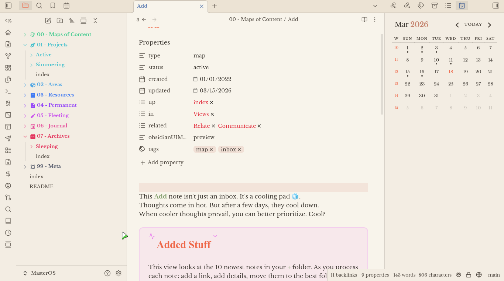
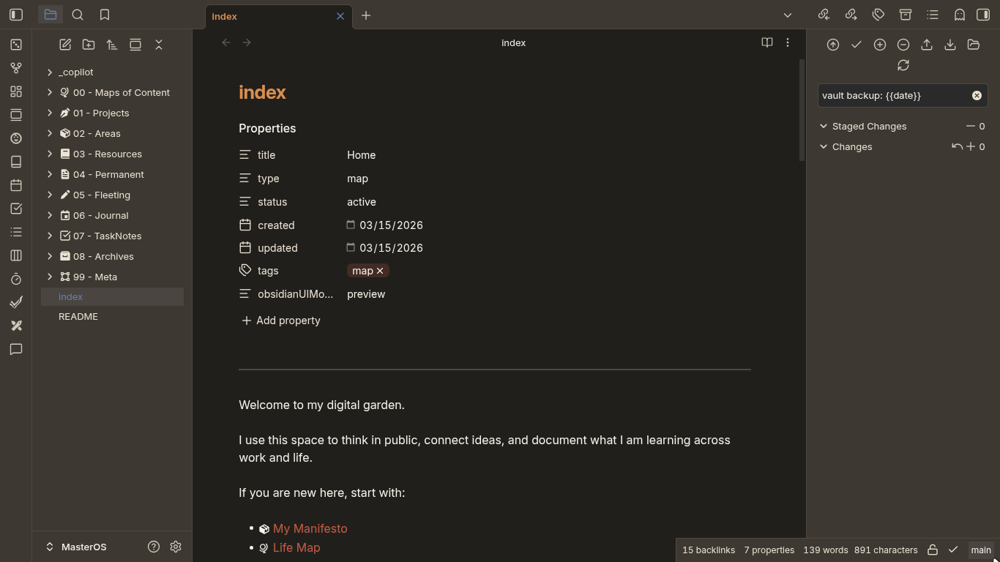

# Obsidian + Cinderpaper Theme

This is a custom Obsidian theme, curated from the Nord template and inspired by the Cinderpaper theme. It aims to provide a clean, minimalist design while maintaining readability and usability.

## Screenshots

### Light Mode

### Dark Mode

## Installation

1. Download the latest release from the [Releases](https://github.com/Adnan0-IM/Obisidian_Cinderpaper/releases) page.
2. Extract the downloaded ZIP file.
3. Copy the extracted folder to your Obsidian vault's `.obsidian/themes` directory.
4. In Obsidian, go to Settings > Appearance > Themes and select "Cinderpaper" from the list.

## Customization

You can customize the theme by editing the `theme.css` file in the theme folder. Here are some common customizations you can make:

- Change the accent color by modifying the `--accent` variable.
- Adjust the font sizes by modifying the `--font-size-base`, `--font-size-heading`, and `--font-size-small` variables.
- Change the font family by modifying the `--font-heading-theme` and `--font-interface-theme` variables.

## Attribution

This theme reuses and modifies CSS from Obsidian Nord:

- Source: https://github.com/insanum/obsidian_nord
- Upstream license: MIT
- What was reused: base theme CSS structure and variables from the upstream theme
- What was changed: variable palette, naming, and additional style customizations for Cinderpaper

This theme is also visually inspired by Cinderpaper.

## Contributing

Contributions are welcome! If you have any suggestions or improvements, please feel free to open an issue or submit a pull request.

## License

This project is licensed under the MIT License. See the [LICENSE](LICENSE) file for details.
